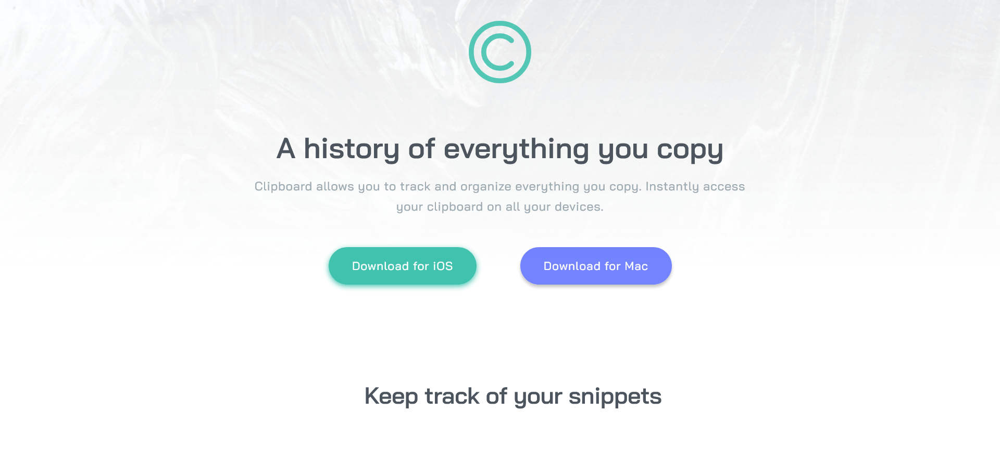

# Frontend Mentor - Clipboard landing page solution

This is a solution to the [Clipboard landing page challenge on Frontend Mentor](https://www.frontendmentor.io/challenges/clipboard-landing-page-5cc9bccd6c4c91111378ecb9). Frontend Mentor challenges help you improve your coding skills by building realistic projects. 

## Table of contents

  - [The challenge](#the-challenge)
  - [Screenshot](#screenshot)
  - [Links](#links)
- [My process](#my-process)
  - [Built with](#built-with)
  - [Continued development](#continued-development)
  - [Useful resources](#useful-resources)
- [Author](#author)
- [Acknowledgments](#acknowledgments)

### The challenge

Users should be able to:

- View the optimal layout for the site depending on their device's screen size
- See hover states for all interactive elements on the page

### Screenshot

Here are some screenshots of my solution, I couldn't take the entire page's screenshot because of the animations.

### Links

- Solution URL: [Solution URL](https://www.frontendmentor.io/solutions/clipboard-landing-page-ztWvKoNdbf)
- Live Site URL: [Live site URL](https://clipboard-solution.netlify.app/)

## My process

### Built with

- Semantic HTML5 markup
- CSS custom properties
- Flexbox
- Mobile-first workflow
- MBEM class notations
- [GSAP](https://greensock.com/get-started/) - Animation library

### Continued development

GSAP is a powerful tool when it comes to animations while scrolling. It gives an smooth and amazing experience for users. I'm definetly gonna use is for my animated websites projects.

### Useful resources

- [Learn gsap scrollTrigger plugin](https://greensock.com/docs/v3/Plugins/ScrollTrigger) - This helped me for scrolling animations. I really liked this plugin and will use it going forward.

## Author

- Frontend Mentor - [@Dytoma](https://www.frontendmentor.io/profile/Dytoma)
- Twitter - [@OmarDytoma](https://www.twitter.com/OmarDytoma)

